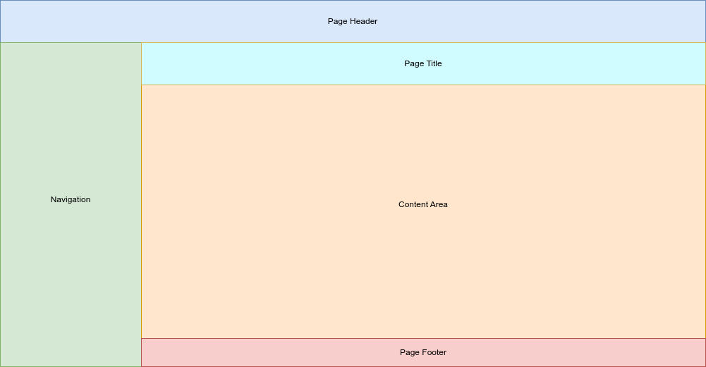
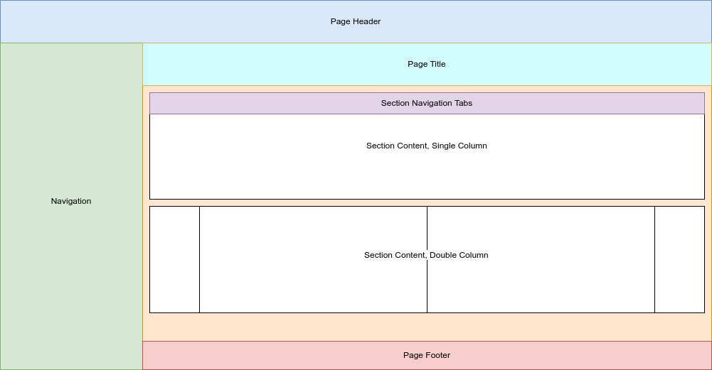

This section of the documentation contains the details related to the templates used within Centurion ERP for rendering data for the end user to view.
The base template is common to all templates and is responsible for the rendering of the common layout. Each subsequent template includes this template. This enables **ALL** pages within the site to share the same layout.



Point of note is that the orange area of the template is what each template is "filling out."

This view contains the following areas:

- Page Header
- Navigation
- Page Title
- Content Area
- Page footer

!!! note
    This template should not be included directly as it is incomplete and requires subsequent templates to populate the contents of the orange area.


## Detail

This template is intended to be used to render the details of a single model. The layout of the detail view is as follows:



This view contains the following areas:

- Section navigation tabs
- Section Content

The page title represents the "what" to the contents of the page. i.e. for a device this would be the device name. A detail page contains navigation tabs to aid in displaying multiple facets of an item, with each "tabbed" page containing one or more sections. Point of note is that the tabs are only rendered within the top section of each "tabbed" page.

Base definition for defining a detail page is as follows:

``` jinja









    your tabs content here



```
