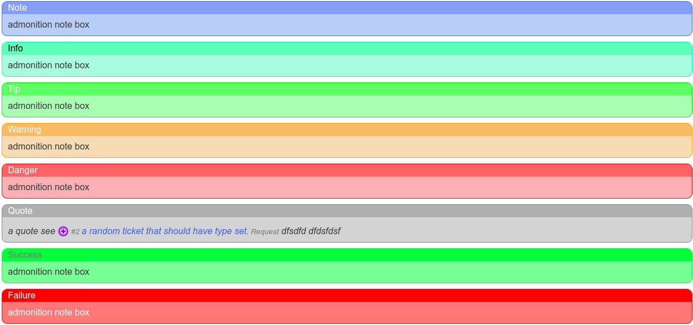

All Text fields, that is those that are multi-lined support markdown text.


## Features

- CommonMark Markdown

- Tables

- Strikethrough

- Code highlighting

- Admonitions

- Linkify

- Task Lists

- Heading Anchors

- Ticket References

- Model References


## Admonitions




declare with:

``` md

!!! <type> "<optional heading in double quotes>"
    text goes here

```

Available admonition types are:

- note

- info

- tip

- warning

- danger

- quote


## Ticket References

Declare a ticket reference in format `#<ticket number>`, and it will be rendered as a link to the ticket. i.e. `#2`


## Model Reference / Model Tag

A Model link is a reference to an item within the database. Supported model link items are:

| Model | Tag |
|:---|:---:|
| [asset](../accounting/asset.md) | `$asset-<id>` |
| cluster| `$cluster-<id>` |
| clustertype| `$-<id>` |
| config groups| `$config_group-<id>` |
| device| `$device-<id>` |
| devicemodel| `$device_model-<id>` |
| devicetype| `$device_type-<id>` |
| entity | `$entity-<id>` |
| externallink| `$-<id>` |
| featureflag| `$feature_flag-<id>` |
| gitrepository| `$git_repository-<id>` |
| gitgroup| `$git_group-<id>` |
| group| `$-<id>` |
| it_asset | `$it_asset-<id>` |
| knowledgebase| `$kb-<id>` |
| knowledgebasecategory| `$kb_category-<id>` |
| manufacturer| `$manufacturer-<id>` |
| modelnotes| `$-<id>` |
| operatingsystem| `$operating_system-<id>` |
| operatingsystemversion| `$operating_system_version-<id>` |
| organization| `$organization-<id>` |
| port| `$-<id>` |
| project| `$-<id>` |
| projectmilestone| `$-<id>` |
| projectstate| `$project_state-<id>` |
| projecttask| `$-<id>` |
| projecttype| `$-<id>` |
| [role](../access/role.md)| `$role-<id>` |
| service| `$service-<id>` |
| software| `$software-<id>` |
| softwarecategory| `$software_category-<id>` |
| softwareversion| `$software_version-<id>` |
| team| `$team-<id>` |
| ticketcategory| `$ticket_category-<id>` |
| ticketcomment| `$-<id>` |
| ticketcommentcategory| `$ticket_comment_category-<id>` |

To declare a model link use syntax `$<type>-<model id>`. i.e. for device 1, it would be `$device-1`
